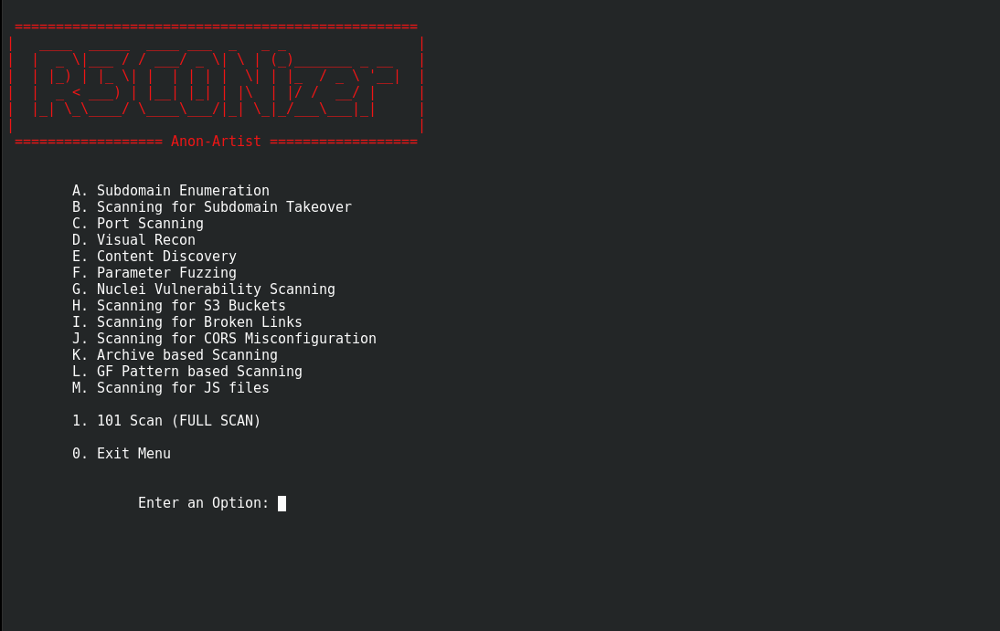

```
 =================================================
|   ____  _____  ____ ___  _   _ _                |
|  |  _ \|___ / / ___/ _ \| \ | (_)_______ _ __   |
|  | |_) | |_ \| |  | | | |  \| | |_  / _ \ '__|  |
|  |  _ < ___) | |__| |_| | |\  | |/ /  __/ |     |
|  |_| \_\____/ \____\___/|_| \_|_/___\___|_|     |
|                                                 |
 ================= Anon-Artist ===================    
```

# Usage :clinking_glasses:
```
git clone https://github.com/Anon-Artist/R3C0Nizer

cd R3C0Nizer

chmod +x prerequisites.sh reconizer.sh

./prerequisites.sh

./reconizer.sh
```

# About :superhero_man:
* R3C0Nizer is the first ever CLI based menu-driven automated web application B-Tier recon framework which install every tools and dependencies while running each modules so that the user need not to install any tools manually and R3C0Nizer is used to gather some assets/informations which should help you to the next step with latest updated, fastest and efficient tools. HAPPY HACKING.

# Workflow :muscle:


# Notes :writing_hand:

* Always enter the domain like target.xyz  
* All outputs can be found in your home_directory/reconizer/target.xyz folder
* You can run any module at any time you wish to do but for every target you should complete the subdomain enumeration first (not applicable for 101 Scan).
* Recommended : Update and upgrade your operating system.
* Optional : Add API keys in config of subfinder and findomain for tweaking perfomance.
* Portscanner does not scan for port 80 and 443 so if the IP only contains only these two ports then the result will not be produce for the IP.
* Recursive scan is implemented in feroxbuster with depth of 3 on all alive subdomains.
* Do not look for nmap and naabu rust scan do the best.
* Used feroxbuster instead of ffuf,wfuzz because feroxbuster is more faster.

# Demo :boom:


# Notification Feature :dizzy:
Added Telegram notification to notify completion of 101 Scan in a domain.
* For this remove # from line 591 to 595 from src/101scan.sh 
* Copy .tgcreds from R3C0Nizer to home_directory/reconizer/.tgcreds
* Create a private telegram channel and create a bot using @botfather (https://telegram.me/botfather) copy token and paste in .tgcreds 
* Add the bot to telegram channel set privilege as an admin.
* Use /start to start bot inside the channel.
* `sudo apt-get install jq`
* `curl -s -X POST https://api.telegram.org/bot<TOKEN>/getUpdates | jq .`
* This command will give chat id paste it in .tgcreds
* Run 101 scan and enjoy notification feature

# Expecting Contributions :monocle_face:

R3C0Nizer is expecting contributions for improving the script such as 

 - Adding more assets
      
# Authors and Thanks :sunglasses:

This script make use of tools developed by the following people/team
- https://github.com/tomnomnom
- https://github.com/epi052
- https://github.com/aboul3la
- https://github.com/OWASP
- https://github.com/Findomain
- https://github.com/v0re
- https://github.com/projectdiscovery
- https://github.com/michenriksen
- https://github.com/devanshbatham
- https://github.com/1ndianl33t
- https://github.com/RustScan
- https://github.com/lc
- https://github.com/tillson
- https://github.com/stevenvachon
- https://github.com/sa7mon
- https://github.com/s0md3v


# Contributors :star_struck:
 
* Details of Contributors:

<table>
  <tr>
    <td align="center"><a href="https://github.com/blackmarketer"><br /><sub><b>Alan Abhilash</b></sub></a><br /><h6><a href="https://github.com/Anon-Artist/R3C0Nizer/pull/1">Contributions</h6></a></td>
   <td align="center"><a href="https://github.com/E-R-R-O-R-404"><br /><sub><b>Vimal V</b></sub></a><br /><h6><a href="https://github.com/Anon-Artist/R3C0Nizer/pull/2">Contributions</h6></a></td>
   <td align="center"><a href="https://github.com/Conscript-Security"><br /><sub><b>Jagan</b></sub></a><br /><h6><a href="https://github.com/Anon-Artist/R3C0Nizer/pull/4">Contributions</h6></a></td>
   <td align="center"><a href="https://github.com/v1nc1d4"><br /><sub><b>Anurag M</b></sub></a><br /><h6><a href="https://github.com/Anon-Artist/R3C0Nizer/pull/5">Contributions</h6></a></td>
   <td align="center"><a href="https://github.com/Shahul-Aboobaker"><br /><sub><b>Shahul Aboobaker</b></sub></a><br /><h6><a href="https://github.com/Anon-Artist/R3C0Nizer/pull/11">Contributions</h6></a></td>
   <td align="center"><a href="https://github.com/GovindPalakkal"><br /><sub><b>Govind Palakkal</b></sub></a><br /><h6><a href="https://github.com/Anon-Artist/R3C0Nizer/blob/main/src/blcscan.sh">Contributions</h6></a></td>
</table>

-------

***Support this project by starring ⭐, sharing 📲, and contributing 👩‍💻! :heart:***

-------
